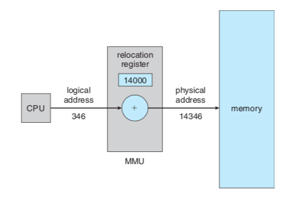

# 메모리 관리 전략

# 논리 대 물리주소 공간

- CPU가 생성하는 주소를 논리 주소, 메모리가 취급하는 주소를 물리 주소라 한다.
- 프로그램 실행 중에는 이와 같은 가상 주소를 물리 주소로 바꿔줘야 하는데, 이 매핑 작업은 메모리 관리기(Memory Management Unit)에서 실행된다.

# 메모리 관리 전략

- 메모리는 각각 주소가 할당 된 일련의 워드 또는 바이트들로 구성된다.
- 주 메모리와 프로세서 자체에 내장되어 있는 레지스터들은 CPU가 직접 접근할 수 있는 유일한 접근장치이다.
- 따라서 모든 실행되는 명령어와 데이터들은 CPU가 직접적으로 접근할 수 있는 주 메모리와 레지스터에 있어야한다.
- 이를 기준과 상한이라고 불리는 두 개의 레지스터들을 사용하여 이러한 보호기법을 제공한다.

→ **제한된 물리 메모리의 효율적인 사용과 메모리 참조방식을 제공하기 위한 전략**

# 효과적인 메모리 사용

### 메모리 낭비 방지

1) **동적 적재(Dynamic Loading)**

- 프로그램 실행에 반드시 필요한 루틴과 데이터만 적재하는 기법
- 모든 루틴과 데이터는 항상 사용하지 않고, 실행 시 필요하다면 그때 해당 부분을 메모리에 적재
- 운영체제로부터 특별한 자원을 필요로 하지 않는다.

2) **동적 연결(Dynamic Linking)**

- 라이브러리 루틴 연결을 컴파일 시점에 하는 것이  아닌 실행 시점까지 미루는 기법
- 운영체제의 도움이 필요하다.

3) **스와핑(Swapping)**

- CPU에서 실행 중이지 않는 프로세스는 저장장치의 Swap영역으로 이동해 메모리를 확보
- 문맥 교환으로 인한 오버헤드가 발생할 수 있고 속도가 느려지지만, 메모리 공간 확보에는 효율적
- swap in : 주기억장치(RAM)으로 불러오는과정
- swap out : 보조 기억장치로 내보내는 과정

# 단편화(Fragmentation)

메모리 공간이 충분함에도 불구하고 프로세스가 메모리에 적재되지 못해 메모리가 낭비되는 현상

**1) 외부 단편화(External Fragmentation)**

- 가변 분할 방식에서 메모리에 프로세스가 적재되고 제거되는 일이 반복되면서, 여유 공간이 충분함도 불구하고 이러한 여유 공간들이 조각으로 흩어져 있어(Scattered Holes) 메모리에 프로세스를 적재하지 못해 메모리가 낭비되는 현상

**2) 내부 단편화(Internal Fragmentation)**

- 고정 분할 방식에서 프로세스가 실제 사용해야할 메모리보다 더 큰 메모리를 할당받아 메모리가 낭비되는 현상

**3) 압축(Compaction)**

- 외부 단편화를 해소하기 위한 방법으로 Scattered Holes를 모으는 방법
- Scattered Holes를 합치는 과정에서 메모리에 적재된 프로세스를 정지시키고 한쪽으로 이동시키는 작업이 필요해 비효율적
- 또한, Scattered Holes를 어느 자유공간을 기준으로 모을지 결정하는 알고리즘도 모호

# 메모리 관리 전략

### 연속 메모리 할당

- 프로세스를 메모리에 연속적으로 할당하는 기법
- 할당과 제거를 반복하다보면 Scattered Holes(흩어진 구멍)가 생겨나고 이로 인한 외부 단편화가 발생

**연속 메모리 할당에서 외부 단편화를 줄이기 위한 할당 방식**

1. 최초 적합(First fit)

- **가장 처음 만나는 빈 메모리 공간**에 프로세스를 할당
- 속도가 빠름

2. 최적 적합(Best fit)

- 빈 메모리 공간의 크기와 프로세스의 크기 차이가 **가장 적은 곳**에 프로세스를 할당

3. 최악 적합(Worst fit)

- 빈 메모리 공간의 크기와 프로세스의 크기 차이가 **가장 큰 곳**에 프로세스를 할당
- 이렇게 생긴 빈 메모리 공간에 또 다른 프로세스를 할당할 수 있을 거라는 가정에 기인

### 페이징(Paging)

- 메모리 공간이 연속적으로 할당되어야 한다는 제약조건을 없애는 메모리 관리 전략
- 논리 메모리는 고정크기의 페이지, 물리메모리는 고정크기의 프레임 블록으로 나누어 관리
- 프로세스가 사용하는 공간을 논리 메모리에서 여러 개의 페이지로 나누어 관리하고, 개별 페이지는 순서에 상관없이 물리 메모리에 있는 프레임에 매핑되어 저장
- MMU(Memory Management Unit)의 재배치 레지스터 방식을 활용해 CPU가 마치 프로세스가 연속된 메모리에 할당된 것처럼 인식하도록 함
- 내부 단편화 발생
- 메모리에 대한사용자 인식과 실제 물리 메모리를 명확하게 분리

### 세그멘테이션(Segmentation)

- 페이징 기법과 반대로 논리 메모리와 물리 메모리를 같은 크기의 블록이 아닌, 서로 다른 크기의 논리적 단위인 세그먼트로 분할
- 외부 단편화 발생

### 세그멘테이션 페이징 혼용기법

- 페이징과 세그멘테이션도 각각 내부 단편화와 외부 단편화가 발생
- 페이징과 세그멘테이션을 혼용해 이러한 단편화를 최대한 줄이는 전략
- 프로세스를 세그먼트(논리적 기능 단위)로 나눈 다음 세그먼트를 다시 페이지 단위로 나누어 관리
- 매핑 테이블을 두 번 거쳐야하므로 속도가 느려짐