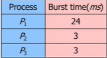

# 스케줄러(Scheduler)

Data Structure: CPU scheduler, scheduler

# Scheduler

---

- 시스템이 실행하고자 할 때 프로세서(CPU)를 프로그램들에게 할당하는 과정

## Scheduler Queue

- 스케줄링을 하기 위한 Queue 3가지.
- Job Queue : 현재 시스템 내에 있는 모든 프로세스의 집합
- Ready Queue : 현재 메모리 내에 있으면서 CPU 를 잡아서 실행되기를 기다리는 프로세스의 집합
- Device Queue : Device I/O 작업을 대기하고 있는 프로세스의 집합

## Types of Scheduler

- 각각의 스케줄링 Queue 를 처리하는 스케줄링 방식 3가지.

### 단기스케줄러(Short-term scheduler or CPU scheduler)

- CPU에서 작업을 처리할 수 있도록 프로세스를 지정해주는 스케줄러

- CPU 와 메모리 사이의 스케줄링을 담당.
- Ready Queue 에 존재하는 프로세스 중 어떤 프로세스를 running 시킬지 결정.
- 프로세스에 CPU를 할당 (Dispatch)
- 프로세스의 상태 ( ready → running → waiting → ready )

### 중기스케줄러(Medium-term scheduler or Swapper)

- 과도한 메모리 사용을 막기위한 조율 장치.

- 여유 공간 마련을 위해 프로세스를 통째로 메모리에서 디스크로 쫓아냄 (Swapping)
- 프로세스에게서 메모리를 deallocate
- 현 시스템에서 메모리에 너무 많은 프로그램이 동시에 올라가는것을 조절
- 프로세스의 상태 ( ready → suspended)

### 장기스케줄러(Long-term scheduler or job scheduler)

- 한정 된 메모리에 너무 많은 프로세스가 할당 되지 않도록 디스크에 임시저장하고, 임시 저장 된 프로세스 중 ready Queue 에 보내줄 프로세스를 정한다.

- 메모리와 디스크 사이의 스케줄링을 담당.
- 프로세스에 memory 를 할당
- degree of Multiprogramming 제어(실행중인 프로세스의 수 제어)
- 프로세스의 상태( new → ready(in memory) )

# CPU Scheduler

---

- Ready Queue 에 있는 프로세스를 처리하는 방식

## FCFS(First Come First Served) - 선입 선처리 스케줄링

- CPU를 먼저 요청하는 프로세스가 CPU를 먼저 할당 받음.

- 비선점형 스케줄링

- ReadyQueue 를 FIFO 큐를 통해 간단하게 구현.

- Convoy Effect(호위 효과)

    ex) P1, P2, P3 순서로 도착했다고 가정

    

    Gantt Chart

    

    - Waiting time for P1 = 0, P2= 24, P3 = 27
    - Average waiting time (0 + 24 + 27) / 3 = 17

    

    - Waiting time for P1 = 6, P2= 0, P3 = 3
    - Average waiting time (0 + 3 + 6) / 3 = 3

## SJF(Shortest - Job - First) - 최소 작업 우선 스케줄링

- 가장 짧은 CPU burst를 갖는 프로세스를 우선 선택.
- 동일한 시간을 갖는다면 FCFS 방식으로 처리.
- 평균 대기 시간이 가장 작다.
- 비선점형 스케줄링
- 극단적으로 CPU burst 가 짧은 것을 선호하기 때문에 사용 시간이 긴 프로세스는 CPU를 거의 영원히 할당 받을 수 없다.

## HRN(Highest Response-Rate Next Scheduling)

- SJF 기법의 단점인 긴 작업과 짧은 작업간의 지나친 불평등을 어느 정도 보완한 기법
- 비선점형 스케줄링
- 우선순위 = (대기시간 + 서비스 받을 시간) / 서비스 받을 시간

Gantt chart

- Waiting time for P2 = 3-2,  P3 = 9-4, P4 = 15-6, P5 = 13-8
- Average waiting time (0+1+5+9+5) / 5 = 4

## SRT(Shortest Remaining time First) - 최소 잔여시간 우선 스케줄링

- 새로운 프로세스가 도착할 때마다 새로운 스케줄링이 생성.
- 선점형 스케줄링
- 더 짧은 CPU burst time 을 가진 프로세스가 나타나면 CPU를 뺏는다.

Gantt chart

- Waiting time for P1 = 0 + 9,  P2 = 0, P3 = 15, P4 = 2
- Average waiting time (9+0+15+2) / 4 = 6.5

## RR(Round Robin) - 순환 할당 스케줄링

- 선점형 FCFS ( 프로세스들 사이를 강제로 옮기기 위한 선점이 추가 된 형태)
- 각 프로세스는 동일한 크기의 할당 시간(Time Quantum)을 갖는다.
- 각 프로세스에 한 번에 할당되는 CPU 시간(10~100msec)
- 해당 시간이 만료되어 설정된 타이머에서 완료 인터럽트 발생시 디스패치
- 디스패치되면 해당 프로세스는 ready queue 의 제일 뒤에서 다시 줄섬.
- 가장 공정한 현대적인 CPU 스케줄링

Time Quantum 이 커지면 FCFS 와 다를게 없어지고, 너무 작으면 잦은 ContextSwitching 로 Overhead발생하므로 적당한 Time Quantum 을 설정하는것이 가장 중요!

Context Switching : CPU가 다음 프로세스를 수행하도록 새로운 프로세스의 상태 또는 레지스터 값(Context)를 **교체하는 작업**

Gantt chart

- Waiting time for P1 = 0 + 6,  P2 = 4, P3 = 7
- Average waiting time (6+4+7) / 3 = 5.66